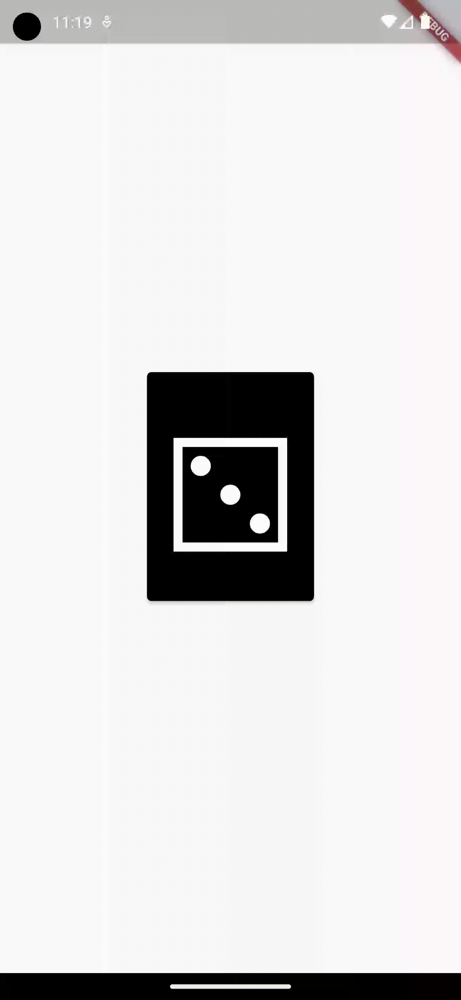

# roll_a_dice

Roll a dice is all you need to play board games with your friends. \
It's a simple app that allows you to roll a dice, flip a coin, draw a card and more to come. \

### Prerequisite : Install Flutter

[https://docs.flutter.dev/get-started/install](https://docs.flutter.dev/get-started/install)

### Launch the app

```flutter run```
### Dice V1



### Dice V0


